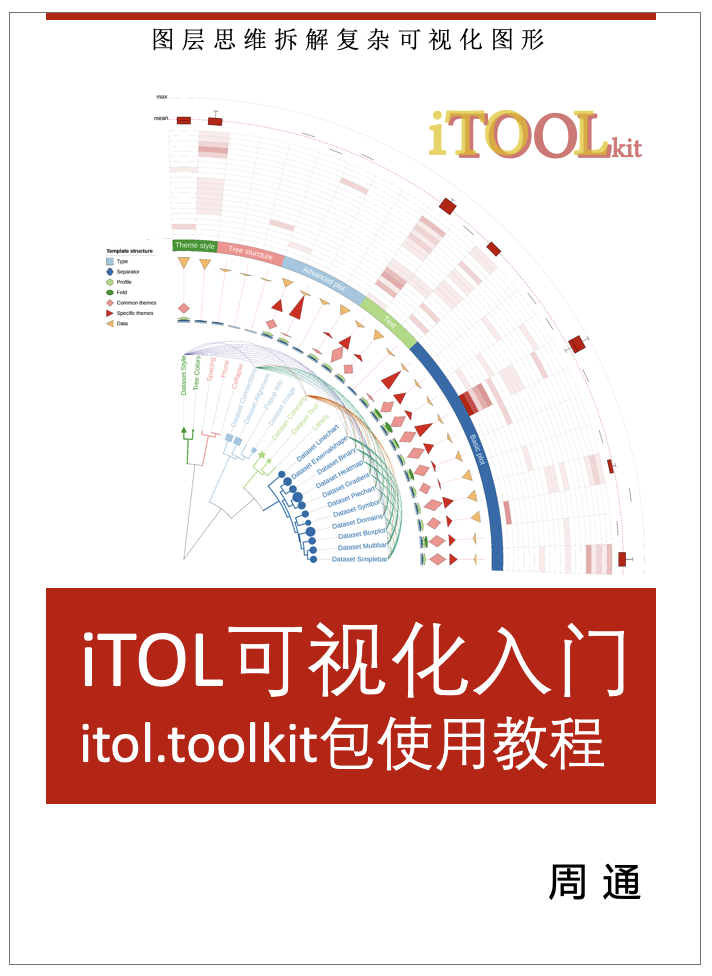

--- 
title: "iTOL可视化入门"
subtitle: "itol.toolkit包使用教程"
author: "周通"
date: "`r Sys.Date()`"
site: bookdown::bookdown_site
documentclass: book
bibliography: [book.bib, packages.bib]
url: your book url like https://github.com/TongZhou2017/itol.toolkit-tutorials-CN
cover-image: images/cover.png
description: |
  This is a minimal example of using the bookdown package to write a book.
  The HTML output format for this example is bookdown::gitbook,
  set in the _output.yml file.
link-citations: yes
github-repo: rstudio/bookdown-demo
---

# 前言 {-}

<a href="https://github.com/TongZhou2017/itol.toolkit-tutorials-CN"></a>

欢迎使用本书，本书为2023年6月第一期中文线上直播教程配套讲义。

本课程为科研成果普及公益免费课程，不以任何形式收费。

课程形式：30分钟讲解（有回放）+30分钟答疑。

直播信息：关注HelloBD、蔻享学术公众号推送。

回放获取：添加微信zitangumu，备注itol-姓名-单位，加入社群，见群公告。

配套讲义：https://github.com/TongZhou2017/itol.toolkit-tutorials-CN

相关论文：Tong Zhou, Kuidong Xu, Feng Zhao et. al. (2023) itol.toolkit accelerates working with iTOL (Interactive Tree Of Life) by an automated generation of annotation files, Bioinformatics, btad339, https://doi.org/10.1093/bioinformatics/btad339

# 课程内容简介 {-}

iTOL是一款常用的生命科学数据可视化工具，以系统发育树为主干，支持多维度数据注释可视化。虽然其操作简便、功能强大、全球用户众多，但高阶功能依赖格式要求严格的模版文件，限制了用户快速上手，导致大量潜能未被充分利用。本课程介绍使用itol.toolkit包在R语言环境中自动生成iTOL模版文件，加速iTOL使用流程，提升工作流程的可复现性。同时，通过图层思维拆解复杂可视化图形，并以实例复现生命科学领域论文主图的方式，帮助不同基础的观众学习。此外，我们还将通过直播讲解结合实战练习及社群答疑的形式来进一步提高学习效果。


```{r include=FALSE}
# automatically create a bib database for R packages
knitr::write_bib(c(
  .packages(), 'bookdown', 'knitr', 'rmarkdown'
), 'packages.bib')
```
